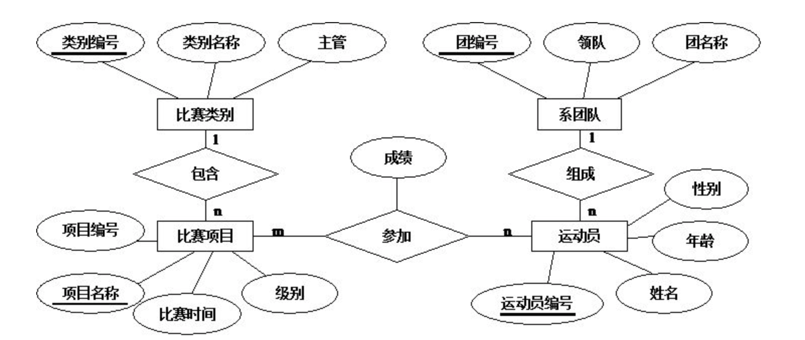
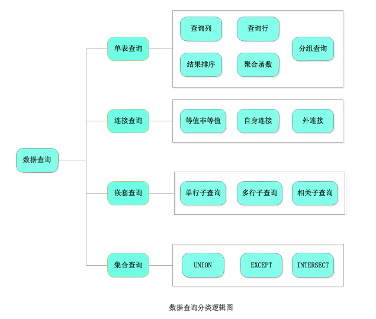
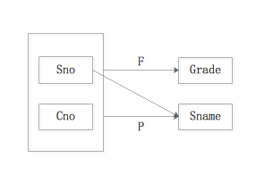
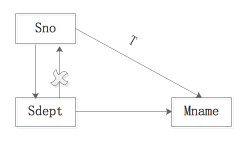

#第1章 数据库技术基础
##1.1 数据管理的三个阶段
* 人工管理阶段
* 文件系统阶段
* 数据库系统阶段  

##1.2 数据库系统（DBS）的组成
*  数据库（Database,DB）
*  数据库管理系统（Database Management System,DBMS）
*  计算机硬件
*  计算机软件
*  人员（DBA等） 

##1.3 数据库系统的模式结构
* 外部层  -->  外模式：用户自定义数据视图，多个。  

  外／概念模式映射，逻辑数据独立性。
     
* 概念层  -->  概念模式：描述实体、属性、联系、完整性约束，只有一个。  
 
 概念／内模式映射，物理数据独立性。
 
* 内部层  -->  内模式：最底层数据结构，只有一个。  

##1.4 数据库系统的数据模型
**数据模型**是对现实世界的模拟，是对现实世界数据特征的抽象。  
###1.4.1 三种数据模型
 * 概念数据模型  
    概念模型不依赖计算机系统，它纯粹反应信息需求的概念结构。  
    **基本术语：**实体、属性、属性值、码、域、实体型、实体集、联系。  
    **表示方法：**E-R图  
    * 实体型：矩形
    * 属性：椭圆形
    * 联系：菱形  
    
    
 * 逻辑数据模型  
   * 层次模型
   * 网状模型
   * 关系模型
   * 面向对象模型
 * 物理数据模型  
 
###1.4.2 数据模型的三要素
* 数据结构
* 数据操作
* 数据约束条件  

#第2章 关系数据库基础  
##2.1 关系数据库的基本概念
**关系模型**是目前最重要的一种**数据模型**，关系数据库是以关系数据模型为基础的数据库。关系模型由 **关系数据结构**、**关系操作集合**、**关系完整性约束** 三部分构成。  

###2.1.1 关系数据结构  
关系模型的数据结构很简单，只包含单一的数据结构——**关系**，一张二维表。 

* 关系：规范化的二维表。
  * 关系中的每一列都是不可在分的几本属性。
  * 关系中各个属性不能重复。
  * 关系中行列的顺序不重要。 
* 域：属性的取值范围。
* 属性
* 元祖：又叫记录
* 关键码
  * 全码：用所有的属性来表示一个元组。
  * 超键：能唯一表示元组的属性或属性集。例如：（sno）、（sno,sname）、（sno、sname、sage）等;
  * 候选码：如果一个属性集能唯一标示元组，**且不含多余的属性**，该属性集就称为该关系的候选码。（sno）、（sno,sname）、（sno、sname、sage）这3个超键中只有（sno）是候选码，因为（sno,sname）、（sno、sname、sage）虽然能唯一标示元组，但含有多余的属性，不能算是候选码。（一个属性可以看作一个特殊的属性集）
  * 主键：在多个候选码中选一个作为主键。
  * 主属性：包含在任何一个候选码中的属性。
  * 非主属性：不包含在任何一个候选码中的属性。
  
> 先说候选码，候选码就是可以区别一个元组（即表中的一行数据）的属性或属性的集合，比如学生表student(id,name,age,sex,deptno),其中的id是可以唯一标识一个元组的，所以id是可以作为候选码的，既然id都可以做候选码了，那么id和name这两个属性的组合可不可以唯一区别一个元组呢？显然是可以的，此时的id可以成为码，id和name的组合也可以成为码，但是id和name的组合不能称之为候选码，因为即使去掉name属性，剩下的id属性也完全可以唯一标识一个元组，就是说，候选码中的所有属性都是必须的，缺少了任何一个属性，就不能唯一标识一个元组了，给候选码下一个精确的定义就是：可以唯一标识一个元组的最少的属性集合。而码是没有最少属性这个要求的。另外，一个表的候选码可能有多个，从这些个候选码中选择一个做为主码，至于选择哪一个候选码，这个是无所谓的，只要是从候选码中选的就行。
至于主属性，刚才提到了，一个表可以有多个候选码，那么对于某个属性来说，如果这个属性存在于所有的候选码中，它就称之为主属性
从百度知道上看到的，觉得非常犀利，特此分享。
  
* 关系模式：对关系的描述称为关系模式（Schema），记为R(U）。
   

基本的操作：**选择**、**投影**、**并**、**差**、**笛卡尔积**，其他的操作都可以用几本的操作导出。  
###2.1.2 关系操作集合
常用的操作：**查询**、**更新**；  

* 查询：**选择**、**投影**、**连接**、**除**、**并**、**交**、**差**、**笛卡尔积**；  
* 更新：**插入**、**删除**、**修改**。  

基本的操作：**选择**、**投影**、**并**、**差**、**笛卡尔积**，其他的操作都可以用几本的操作导出。  
###2.1.3 关系完整性约束
 * **实体完整性**：主键不能为空
 * **参照完整性**：外键要么为空，要么等于被参照关系对应的主键的键值（被参照关系可以是自 身，也可以是别的关系。例如，员工的上司就是参照员工关系自身）。
 * **用户自定义完整性**：定义好属性的域。  

##2.2 关系代数
* **并**
* **交**
* **差**
* **笛卡尔积**
* **选择**
* **投影**
* **连接**
  * **θ连接**
    在笛卡尔积的基础上选取满足θ关系的元组构成的关系。
  * **自然连接**
    在θ连接的基础上
* **除**  
  关系R(X,Y),S(Y,Z),(X、Y、Z既可以是属性，也可以是属性集合)。  
  R(X,Y)／S(Y,Z) = P(X);  
  x在R中的象集 包含S在Y的投影集合。  
  常用于筛选R中 包含了全部S中Y的 X。  
  
#第3章 SQL语言
##3.1 SQL概述
SQL(Structured Query Language)结构化查询语言。 
 
* SQL的使用方式：**自含式**，**嵌入式**。
* SQL表达式：
   * 常量
   * 变量：**数值型**、**字符串形**、**二进制型**、**时间型**。
   * 函数
   * 表达式
* SQL的功能：  
  * **数据定义**：CARETE,ALTER,DROP;
  * **数据查询**:SELECT;
  * **数据操作**:INSERT,UPDATE,DELETE;
  * **数据控制**:GRANT,REVOKE;  

##3.2 SQL数据定义
关系数据库的基本对象包括：**基本表**、**视图**、**索引**，所以SQL数据定义就是**基本表**、**视图**、**索引**的定义。  
###3.2.1 创建、修改、删除 [基表]  
#### （1)、创建表  
**格式**  

```
	CREATE TABLE <表名>（
	                   <列名> <数据类型> [列级完整性约束] 
	                   [,<列名> <数据类型> [列级完整性约束]]...
	                   [,<表级完整性约束>]
	                  ）；  
	注意：
	[]里边的内容是可选的，<>里面的内容是必须的。
```
**示例** 

```
	CREATE TABLE User_table（
	                   user_id bigint NOT NULL PRIMARY KEY,
	                   user_name varchar(50) NULL
	                   ）；
```
```
	CREATE TABLE Order_table（
	                     order_id bigint NOT NULL,
	                     book_id bigint NOT NULL,
	                     book_count int NULL,
	                     PRIMARY KEY CLUSTERED(order_id,book_id),
	                     FOREIGN KEY (order_id) REFERENCE orderInfo_table (order_id),
	                     FOREIGN KEY (book_id) REFERENCE book_table (book_id)
	                   ）；
```
#### （2)、修改表  
**格式**  

```
	ALTER TABLE <表名>
	    [ADD <列名> <数据类型> [完整性约束]]
	    [DROP <列名>]                    //删除属性，注意与删除表的区别
	    [ALTER COLUMN <列名> <数据类型> [完整性约束]];
	注意：
	[]里边的内容是可选的，<>里面的内容是必须的。  
	修改表没有 {}。
```
**示例**
  
```
	ALTER TABLE User_table
         ADD user_age tinyint NULL;
```
```
	ALTER TABLE User_table
	      DROP user_age;
```
```
	ALTER TABLE User_table
	     ALTER COLUMN user_name varchar(100) NULL;
```

#### （3)、删除表  
**格式**  

```
	DROP TABLE <表名>

```

###3.2.2 创建、删除 [索引]
索引是建立在表上的，如同一本书的目录可以提高检索书中内容的速度一样，索引可以提高表中数据的查询速度。
#### （1)、创建索引
格式

```
CREATE [UNIQUE] [CLUSTERED] [NOCLUSTERED] INDEX <索引名> ON <表名>（
       <列名>[ASC|DESC][,<列名>[ASC|DESC]]...
      ）；
 解释：
     ASC:升序；
     DESC:降序；
     UNIQUE:创建唯一的索引，不允许存在索引值相同的两行。

``` 
示例

```
CREATE INDEX UserOder_index ON Order_table(order_id);

```

#### （2)、删除索引
格式

```
DROP INDEX <索引名> ON <表名>；
``` 
示例

```
DROP INDEX UserOder_index ON Order_table；

```

###3.2.3 创建、删除 [视图]

**视图**是一种逻辑对象，是对一张表或多张表（或视图）的查询而导出的表。视图不存储数据，数据库只存储视图的定义，数据来源于其引用的表。视图如同一个可以移动的窗口，通过“移动”窗口可以看到不同的数据。


#### （1)、创建视图
格式

```
CREATE VIEW <视图名>
       AS <SELECT语句>;
``` 
示例

```
CREATE VIEW myCollection_view
       AS 
       SELECT user_id FROM User_table;

```

#### （2)、删除视图
格式

```
DROP VIEW <视图名>;
``` 

##3.3 SQL数据查询
SELECT语句的基本格式  
  
```
SELECT [ALL|DISTINCT] <目标表达式> [,<目标表达式>]...
FROM <表名或视图名> [,<表名或视图名>]...
[WHERE <条件表达式>]
[GROUP BY <列名> [HAVING <条件表达式>]]
[ORDER BY <列名> [ASC|DESC] [,<列名> [ASC|DESC]]...;

```

###3.3.1 单表查询
（1）**查询列**  
 
```
SELECT * FROM User_table;//查询所有列。

SELECT user_id FROM User_table;

```  

（2）**查询行**

```
SELECT user_id FROM User_table
WHERE user_name = ’jack‘; //返回符合 user_name = ’jack‘ 的行。

//常用条件表达式
WHERE user_age BETWEEN 10 AND 20
WHERE user_name IN ('章三','里斯','王武')
WHERE user_name LIKE '王%'

```  
  
（3）**查询结果排序**  

```
SELECT user_name,user_age FROM User_table
ORDER BY user_age DESC; //按年龄降序返回条目。

``` 

（4）**使用聚合函数**  

*  COUNT()
*  SUM()
*  AVG()
*  MAX/MIN()

```
SELECT COUNT(*) FROM User_talbe;//返回表中用户数量。
SELECT COUNT(DISTINCT user_nation) FROM User_talbe;//返回表中用户来自多少国家。DISTINCT用于消除相同的条目。

SELECT SUM(work_time) FROM work_talbe
WHERE user_id = 5;//返回编号为5的员工的工作总时长。

SELECT AVG(user_salary) FROM salary_talbe
WHERE user_id = 5;//返回编号为5的员工的平均薪水。

SELECT MAX(user_salary) FROM salary_talbe
WHERE user_id = 5;//返回编号为5的员工的最高薪水。

```

（5）**查询结果分组**  
GROUP BY 子句会对相同的列值合并为一组。

```
SELECT user_nation FROM user_table
GROUP BY user_nation;//返回用户国家列表（每个国家只返回一次）。
//注意与聚合函数的区别，聚合函数返回符合条件的行的数量，分组则返回具体的行。


SELECT user_id FROM salary_talbe 
GROUP BY user_id 
HAVING AVG(user_salary) > 5000;//筛选平均薪水大于5000的用户id。
//如果条件表达式用在分组之后，要加上HAVING。

``` 

###3.3.2 连接查询
**连接查询**是对 **两个或两个以上的表或视图** 进行查询。  

（1）**等值非等值**  
   WHERE <条件连接>  根据 **条件连接** 来区分 **等值连接** 和 **非等值连接**。 
   
  ```
  SELECT user_name,user_salary FROM user_table,salary_table
  WHERE user_table.user_id = salary_table.user_id;
  //两个表的列名相同时，要添加表面作为前缀，避免二意性。
  
  //另一种写法
  SELECT user_name,user_salary FROM User_table INNER JOIN Salary_table
  ON user_table.user_id = salary_table.user_id；

  ```  

（2）**自身连接**   
 
  ```
  //查询用户表中同名的用户。
  SELECT A.user_id,A.user_name,B.user_id FROM A.User_table,B.User_table
  WHERE A.user_name = B.user_name；
  ```  
    
（3）**外连接**  
 普通连接中，查询的结果只输出**满足条件的行**，外连接除了输出满足连接条件的结果之外，**也输出不满足条件的结果**。不满足的部分用NULL输出。
###3.3.3 嵌套查询  
 内层查询的结果 作为 外层查询的参数，根据 内层查询的结果的数量 分为 单行子查询 和 多行子查询。  
（1）**单行子查询**  
 
  ```
  
  //查询研发部的成员名字。
  SELECT user_name FROM User_table
  WHERE user_departmentId = (
     SELECT department_id From Department_table
     WHERE department_name = '研发部'  
    )；
  
  ```  
    
（2）**多行子查询**  
  
  ```
  //写法一:将单行子查询中的 '=' 改成 ‘IN’，‘NOT IN’
  SELECT nation_name FROM Nation_table
  WHERE nation_id IN (
        SELECT DISTINCT user_nationId FROM User_table
        );
        
  //写法二:EXISTS语句
  SELECT nation_name FROM Nation_table
  WHERE EXISTS (
        SELECT * FROM User_table,Nation_table 
        WHERE user_nationId = nation_id
        );
    
  //写法三:ALL、ANY
  筛选出全体中的工龄比部门2中最高工龄的还高的工人姓名、工龄。
  SELECT user_name user_workAge FROM User_table
  WHERE user_workAge > ALL(
        SELECT User_workAge FROM user_table
        WHERE user_departmentId = 2);
  
  ```
（3）**相关子查询**  
内层查询的查询条件 依赖于 **外层查询的某个列值**。
###3.3.4 集合查询
（1）**UNION**：对应关系代数 并  
（2）**EXCEPT**  差  
（3）**INTERSCET** 交  

  ```
  SELECT user_name FROM User_table
  WHERE user_workAge > 10
  UNION
  SELECT user_name FROM User_table
  WHERE user_id < 20;
  
  ```  
##3.4 SQL数据操作
* 数据插入 INSERT
* 数据修改 UPDATE
* 数据删除 DELETE  

###3.4.1 数据插入
格式  

```
INSERT INTO <表名|视图名>
(<列名> [,<列名>]...)
VALUES(<常量> [,常量]...)
```
###3.4.1 数据更新
格式  

```
UPDATE <表名|视图名>
STE <列名> = <表达式> [,<列名> = <表达式>]...
WHERE <条件表达式>
```

示例  

```
UPDATE user_table
STE user_status = 1;//没有WHERE子句，所以用户的状态都设为1.

UPDATE user_table
STE user_status = 1
WHERE user_id = 20;

```
###3.4.1 数据删除
 格式  

```
DELETE FROM <表名|视图名>
WHERE <条件表达式>
```

示例  

```
DELETE FROM user_talbe //没有WHERE子句，删除所有条目，但不会删除表的定义。

注意与删除表（DELETE TABLE <表>）的区别：
删除表会把所有条目数据还有表的定义都删去了。

DELETE FROM user_talbe
WHERE user_id = 100;//删除一个条目
```

##3.5 SQL数据控制
数据库的安全性体现在对数据访问的权限控制，数据库管理员负责数据库操作权限分配。  
###3.5.1权限
* SELECT
* INSERT
* DELETE
* UPDATE
* ALL PRIVILEGES（所有权限）  

###3.5.2授权
格式  

```
GRANT <权限> [,<权限>]...[ON <对象类型> <对象名>] TO <用户> [,<用户>]...[WITH GRANT OPTION];
对象类型：TABLE,DATABASE
WITH GRANT OPTION:将分配 分配给该用户的 权限的能力也给该用户
```
###3.5.3权限收回
 
 ```
REVOKE <权限> [,<权限>]...[ON <对象类型> <对象名>] FROM <用户> [,<用户>]...[CASCADE|RESTRICT];
对象类型：TABLE,DATABASE
CASCADE:连环回收

 ```  
##3.6 存储过程和函数
存储过程通常单独执行，而函数则是要放在SQL语句里使用。
###3.6.1 存储过程
存储过程其实就是对用户常用的操作进行封装，方便用户多次调用。
（1）**创建存储过程**  
   格式  
   
   ```
   CREATE PROCEDURE <存储过程名> [<参数> <参数类型> [OUTPUT],...]
   AS <SQL语句>;   
   ```
   示例  
   
   ```
   CREATE PROCEDURE AddUser_procedure
   @user_name VARCHAR(50),@user_age TINYINT
   AS
   INSERT INTO User_table(user_name,user_age) 
   VALUES(@user_name,@user_age);
   
   //创建带输出参数的存储过程。
   CREATE PROCEDURE NationOfChinaCount_procedure
   @nation_id BIGINT @nationCountOutput INT OUTPUT
   AS 
   SELECT @nationCount = COUNT(*)
   FROM User_table INNER JOIN Nation_table
   ON user_nationId = nation_id
   WHERE nation_id = @nation_id;
   ```
     
（2）**调用存储过程**  
   格式  
   
   ```
   EXECUTE PROCEDURE <存储过程名> [[,<输入参数名>] = <输入参数值> | <输出参数名>OUTPUT...]; 
   ```
   示例  
   
   ```
   EXECUTE PROCEDURE AddUser_procedure
   @user_name = '章三'，@user_age = 24; 
   
   //调用带输出参数的存储过程。
   DECLARE @@ncount AS INT
   EXECUTE NationOfChinaCount_procedure @nation_id = 1, @nationCountOutput =       
   @@ncount OUTPUT
   SELECT @@ncount; 
   ```   
（3）**修改存储过程** 
   格式  
   
   ```
   ALTER PROCEDURE <存储过程名> [<参数> <参数类型> [OUTPUT],...]
   AS <SQL语句>;   
   ``` 
（4）**删除存储过程**
   格式  
   
   ```
   DROP PROCEDURE 
   ``` 
###3.6.2 函数
暂时省略。

# 第4章 关系模式设计基础
##4.1 关系模式的设计准则
###4.1.1 不好的关系模式带来的问题
假如存在这样一个不好的关系 Student(Sno,Sname,sdept,Mname,Cno,Cname,Credit,Grade)

|  Sno  | Sname |  sdept  | Mname |  Cno  |  Cname  | Credit | Grade |
|:------|:------|:--------|:------|:------|:--------|:-------|:------|
| 1401  | jake  | computer| mayun | 1000  |  JAVA   |  3.5   |   90  |
| 1401  | jake  | computer| mayun | 1001  |   OS    |  3     |   97  |
| 1402  | mike  | foreign | huaten| 1002  |  RUSSIA |  3     |   80  |
 * 数据冗余问题
 * 数据操作异常问题
   * 插入异常：假如新来的以为同学还没选课，导致他的信息无法插入。
   * 修改异常：要修改JAVA课程的学分，则要修改全部的条目。
   * 删除异常：如果要删除1402的信息，则会导致只有他一个人选的RUSSIA的信息也被删去了。  
  
###4.1.2 关系模式的非形式化设计准则
* 关系模式的设计要尽可能只包含**直接联系**的属性。
* 关系模式的设计应尽可能避免出现数据操作异常。
* 避免空值。
* 关系模式的设计应尽可能使得关系的连接操作在作为**主键或外键**的属性上进行**等值连接**。  

##4.2 函数依赖
通常关系模型包含两种关系 ： 
 
 * **实体**：**定义一个实体**，E-R图中用 **矩形** 表示的关系。  
   如：  
   Student（Sno,Sname,Sdept）;  
   Dept (Dno,Dname,Mname);// Dno等同于 Student中的 Sdept
   Course (Cno,Cname,Credit);
 * **实体联系**:**定义两个实体的联系**，E-R图中用 **棱形** 表示的关系。  
  如：  
  MajorCourse(Sno,Cno,Grade);  
  
  通常，一个**实体型**关系，需要一个属性（该实体的主码）就可以标识一个关系，如一个学号可以标识一个学生；一个课程号可以标识一门课程。  
  而一个**实体联系型**关系，需要两个属性（分别是发生联系的两个实体的主码）才可以标示一个这样的一个关系，如一个学号和一个课程号才能标示一个选课信息。

###4.2.1 函数依赖的定义
Sno决定Sname（知道了学号，就知道了名字），称Sno决定Sname，或Sname 函数依赖于 Sno。  

需要注意的是函数依赖只能根据数据在实际中的含义来确定。例如，如果学校里没有重名的，那么名字也能决定学号。  
  
相互依赖：Cno决定Cname，Cname决定Cno。
###4.2.2 部分函数依赖和完全函数依赖
  

(Sno,Cno) -> Grade，但Sno -> Grade, Cno -> Grade都不成立，是完全函数依赖。  
(Sno,Cno) -> Sname 但Sno -> Sname成立，是部分函数依赖。  

只有当 决定因素是**组合属性**的时候 才有可能出现部分函数依赖。而 **实体联系型**关系的决定因素（主码）是**组合属性**（两个属性），也就是说，部分函数依赖容易出现在 **实体联系型** 关系中。   

消除非主属性对主码的部分函数依赖 其实就是要求设计者在设计 **实体联系型** 关系模式的时候，只需要关注发生联系的两个实体的主属性间的关系(Sno,Cno)，以及它们共同决定的属性(Grade)，而不要出现任何两个实体的非主属性(Sname（Student的非主属性）)。
###4.2.3 传递函数依赖
  
Sno -> Sdept成立, Sdept ->Mname成立, Sdept -> Sno 不成立 ==> Mname 传递依赖于 Sno，三个条件缺一不可。  
传递依赖违反了 关系模式的非形式化设计准则 第一条：关系模式的设计要尽可能只包含**直接联系**的属性。,既然Sno -> Sdept,且 Sdept -> Mname，那么 Mname对于这个关系来说就不是直接联系的属性。  
  
传递依赖很容易出现在 **含有外键** 的关系中。所谓外键，就是另一个实体的主键。

消除非主属性对主码的传递依赖 其实就是要求设计者在设计 **含有外键** 的关系模式的时候，不要出现外键（Sdept）所在实体(Dpet)的非主属性(Mname)。  

含有外键的关系既可以是 实体型关系，也可以是 实体联系型关系。  

*  实体型关系：Student（Sno,Sname,Sdept），Sdept是外键
*  实体联系型关系 ：MajorCourse(Sno,Cno,ClassLevel); ，ClassLevel是外键。  
                 Class(ClassLevel,Grade);('A',100)。  
      
 结论：**所以把消除了非主属性对主码的部分函数依赖作为第二范式，把消除了了非主属性对码的传递函数依赖作为第三范式**  
 
##4.3 范式和规范化方法
###4.3.1 第一范式
如果一个关系模式R的所有属性都是不可分的基本数据项，这个关系模式属于第一范式。 
第一范式是关系模式的最低要求，不能满足1NF的数据模式不能称为关系模式。  

###4.3.2 第二范式
如果R属于1NF，且每个非主属性都完全依赖与码（消除非主属性对码的部分函数依赖），R属于第二范式
###4.3.3 第三范式
如果R属于1NF，且每个非主属性既不部分函数依赖码，也不传递依赖码，R属于第三范式。
###4.3.4 BCNF
如果R属于1NF，R中的的每个决定因素都包括码，R属于第BC范式。BCNF实际上保证了**所有属性**既不部分函数依赖码，也不传递依赖码

